# RustCalc

A CLI calculator written in rust

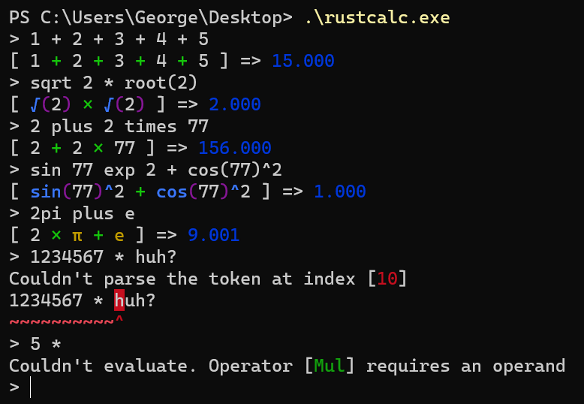

# Features

 - **Advanced Editing**: Rustcalc allows you to edit statements in-line and keeps a navigatable history of your input
 - **Implicit Parentheses**: For functions accepting one parameter, the parantheses may be omitted and Rustcalc will insert them for you.
 - **Implicit Coefficients**: In certain situations Rustcalc will insert a multiplication operation on your behalf. Example: `1 2 3` is interpreted as `1 * 2 * 3`.

## Bedmas

Rustcalc obeys the standard order of operations:

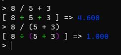

## Expressivity

Rustcalc supports multiple representations of standard operations, including plain English!

> A full list of operators is available in [the reference](#operators)

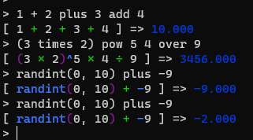

## Constants

Rustcalc comes with some useful predefined constants.

> A full list of constants is available in [the reference](#constants-1)


## Variables

You can define your own variables and use them in computation.

Variables are indicated by a `$` prefix.


There are no restrictions on variable names:

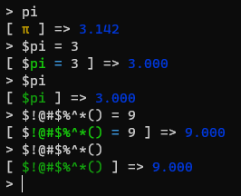

You can list all defined variables with `$`!

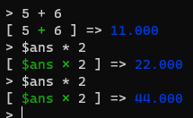

`$ans` is defined for you, and takes on the value of the last statement!


## Functions

Rustcalc supports user-defined functions. Functions take an input via arguments and produce a value through using operators and other functions.
Functions are always prefixed with an octothorpe (`#`).

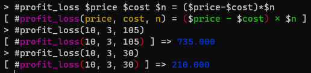

This function, `#profit_loss` can calculate the profits or losses of a position in the stock market given the number of shares, current price, and book cost.

Functions can call other functions:

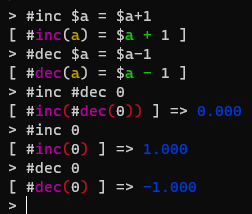

Functions can call themselves!

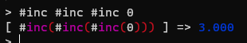

Tip: Functions are lazily evaluated, so you can define them out-of-order!

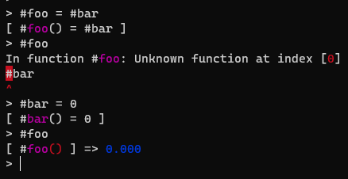

Functions can access variables from outer scopes! Just make sure that they're defined when you call.

(`$ans` is only defined after a statement is executed)

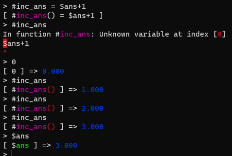

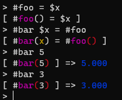

> Here, `$x` is defined within `#foo` because it is called within `#bar` where the variable is introduced as an argument.
>
> However, calling `#foo` directly would result in an error if `$x` is not defined globally.

Local arguments will take precedence over scoped variables.

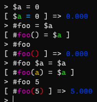

Multi-argument functions!

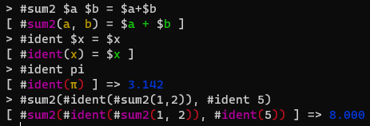

## RCFile

Rustcalc supports running a script at runtime. On first run, Rustcalc will generate a default RCFile.

On startup, Rustcalc will load the RCFile and run each line as if it had been input manually.

> ### Note
> Unlike manual input, statements executed from the RCFile are silent. Thus, while you could have something like: `1 + 2` in your RCFile, it would be ineffectual.

This allows you to define variables that will be available immediately.

On first startup:

```
RCFile doesn't exist. Creating default at [C:\Users\George\AppData\Roaming\rustcalc.rc]
```

Example RCFile:

```
// I use this a lot
$golden_ratio = 1.618033
```

`$golden_ratio` will then be created at startup and available for use immediately.

## Descriptive Errors

Rustcalc strives to provide insightful messages when errors arise. Some examples:

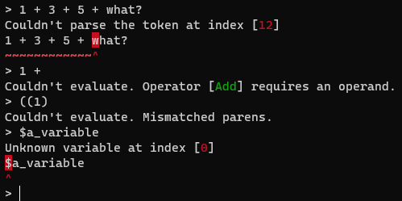

# Reference

## Operators

Meta:
- Builtin operator arguments are unnamed, here they shall be named `a` and `b`
- Trigonometric functions operate in radians, as opposed to degrees

Names | Description | Usage
--- | --- | ---
+, add, plus | Add `a` and `b` | 1 + 2 -> 3
-, subtract, sub, minus | Subtract `b` from `a` | 1 - 2 -> -1
×, ⋅, *, times, mul | Multiply `a` and `b` | 4 * 5 -> 20
÷, /, over, divide, div | Divide `a` by `b` | 1 / 2 -> 0.5
^, exp, pow | Raise `a` to the `b`'th power | 2^5 -> 32
%, mod | Modulus `a` by `b` | 5 mod 3 -> 2
sin | Calculate sine of `a` | sin(2) -> 0.909
cos | Calculate cosine of `a` | cos(2) -> -0.416
tan | Calulate tangent of `a` | tan(2) -> -2.185
max | Calculate the max of `a` and `b` | max(1, 2) -> 2
min | Calculate the min of `a` and `b` | min(1, 2) -> 1
√, sqrt, root | Calculate the square root of `a` | sqrt(2) -> 1.414
!, factorial, fact | Calculate the factorial of `a` | 5! -> 120
randf, randfloat | Generate a random real number on the range `[a, b]` | randf(0, 1)
randi, randint | Generate a random integer on the range `[a, b]` | randint(0, 10)

## Constants

Names | Value
--- | ---
π, pi | 3.1415...
τ, tau | 6.283...
e | 2.718...

# Syntax and Grammar

Rustcalc is operated via a series of statements entered by the user on the command line.

There are four types.

## Expression

This is the most basic kind of statement. It consists of value types like numbers and variables, and operators. The input is passed to the evaluation engine and a numerical result is produced.

On success, Rustcalc prints the following:

```
[ an idealized representation of the input ] => the result rounded to 3 decimal places
```

### Components

Expressions are formed of several components.

#### Numeric Literals

These are base-10 numbers with a literal value. Examples include `10`, `10.`, and `10.0`.

#### Constants

Constants are built into Rustcalc and are symbolic representations of numbers. They act similarly to numeric literals. See the reference for an exhaustive list.


#### Variables

Variables are user-defined symbols that represent a value. They are similar to constants in many ways, but can have their value modified at runtime. Variables are always prefixed with a `$`.

#### Operators

Operators are fundamental operations built into Rustcalc that accept one or more  and produce an output. Examples include `+`, `*`, and `!`. See the reference for an exhaustive list.

#### Functions

Functions are user-defined operators that accepts zero or more arguments and produce a numeric result. Functions have a fixed number of arguments that can be
accessed within their body using variable syntax. Variables can also call other functions, including themself, and access variables from outer scopes.
Functions are always prefixed with a `#`

### Examples:

A single number, the simplest expression:

```
> 0
[ 0 ] => 0.000
> (1)
[ (1) ] => 1.000
```

An expression with a single operator:

```
> 1 + 2
[ 1 + 2 ] => 3.000
```

## Function Assignment

This kind of statement is used to create or modify a function. It consists of a name for the function, a list of arguments, and a function body.

A function assignment is formed:
```
#function_name $arg_one $arg_two ... = expression
```

Where `#`, `$`, and `=` are literal, `function_name` is the desired name of the function, `arg_one` and `arg_two` are arguments to the function, `...` represents where additional arguments would be added, and `expression` is the function body. The function body has access to the function's arguments using variable syntax, variables from outer scopes, and other functions (including itself).

On success, Rustcalc will output in the following format:

```
[ #function_name(arg_one, arg_two, ...) = an idealized representation of the expression ]
```

### Example

```
#five = 5
```

This function `#five` takes no arguments and returns the number `5`.

It can be used like so:

```
> #five() * #five()
[ #five() × #five() ] => 25.000
```

---

```
#sum2 $x $y = $x + $y
```

This function sums two numbers.

## Function List

The function list statement is a literal `#`. Rustcalc will list all of the defined functions in the following format:

```
[ #foo(x) = $x ]
[ #sum2(a, b) = $a + $b ]
...
```

Note: This is the same format as Rustcalc outputs after a successful assignment

## Variable Assignment

This kind of statement is composed of a variable name and an expression. The expression is evaluated and then that value is stored inside the variable.

A variable assignment is formed:
```
$variable_name = expression
```

where `$` and `=` are literal, `variable_name` is any valid identifier, and `expression` is an arbitrary expression.

This statement will create a new variable or update the value of an existing variable.

When the expression evaluated successfully Rustcalc prints in the following format:

```
[ $variable_name = an idealized representation of the expression ] => the new value of $variable_name rounded to 3 decimal places
```

### Example

```
> $x = 7.5
[ $x = 7.5 ] => 7.500
```

## Variable List

The variable list statement is a literal `$`. Rustcalc will list all of the defined variables in the following format:

```
[ $a => the value of $a rounded to three decimal places ]
[ $b => the value of $b rounded to three decimal places ]
...
```

Note: This is the same format as Rustcalc outputs after a successful assignment
