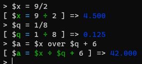
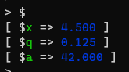

# RustCalc

A CLI calculator written in rust

## Screenshot


# Features

 - **Advanced Editing**: Rustcalc allows you to edit statements in-line and keeps a navigatable history of your input
 - **Implicit Parenthese**: For functions accept one parameter, the paranthese may be omitted and Rustcalc will insert them for you.


## Bedmas

Rustcalc obeys the standard order of operations:


## Expressivity

Rustcalc supports multiple representations of standard operations, including plain English!

> A full list of operators is available in the [Reference](tbd)


## Constants

Rustcalc comes with some useful predefined constants:


## Variables

You can define your own variables and use them in computation.

Variables are indicated by a `$` prefix.



There are no restrictions on variable names:


You can list all defined variables with `$`!



`$ans` is defined for you, and takes on the value of the last statement!


## RCFile

Rustcalc supports running a script at runtime. On first run, Rustcalc will generate a default RCFile.

On startup, Rustcalc will load the RCFile and run each line as if it had been input manually.

This allows you to define variables that will be available immediately.

On first startup:

```
RCFile doesn't exist. Creating default at [C:\Users\George\AppData\Roaming\rustcalc.rc]
```

Example RCFile:

```
// I use this a lot
$golden_ratio = 1.618033
```

`$golden_ratio` will then be created at startup and available for use.

## Descriptive Errors

Rustcalc strives to provide insightful messages when errors arise. Some examples:


# Reference

## Operators

Meta:
- Builtin operator arguments are unnamed, here they shall be named `a` and `b`
- Trigonometric functions are in degrees, as opposed to radians

Names | Description | Usage
--- | --- | ---
+, add, plus | Add `a` and `b` | 1 + 2 -> 3
-, subtract, sub, minus | Subtract `b` from `a` | 1 - 2 -> -1
×, ⋅, *, times, mul | Multiply `a` and `b` | 4 * 5 -> 20
÷, /, over, divide, div | Divide `a` by `b` | 1 / 2 -> 0.5
^, exp, pow | Raise `a` to the `b`'th power | 2^5 -> 32
%, mod | Modulus `a` by `b` | 5 mod 3 -> 2
sin | Calculate sine of `a` | sin(2) -> 0.909
cos | Calculate cosine of `a` | cos(2) -> -0.416
tan | Calulate tangent of `a` | tan(2) -> -2.185
max | Calculate the max of `a` and `b` | max(1, 2) -> 2
min | Calculate the min of `a` and `b` | min(1, 2) -> 1
√, sqrt, root | Calculate the square root of `a` | sqrt(2) -> 1.414
!, factorial, fact | Calculate the factorial of `a` | 5! -> 120
randf, randfloat | Generate a random real number on the range `[a, b]` | randf(0, 1) -> ind
randi, randint | Generate a random integer on the range `[a, b]` | randint(0, 10)
\+ | Positive unary operator | +1 -> 1
\- | Negative unary operator | -1 -> -1

## Constants

Names | Value
--- | ---
π, pi | 3.1415...
τ, tau | 6.283...
e | 2.718...